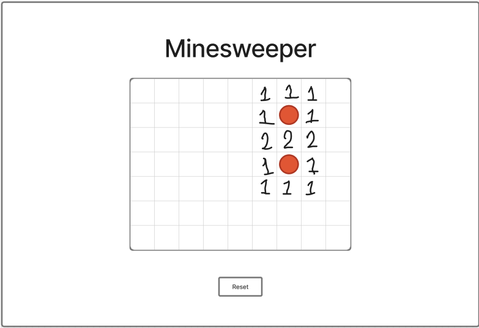

# **_Minesweeper_**

## **_Date:_** 4/24/2025

### **_By:_** Basel Mohamed

[GitHub](https://github.com/BMH2000619)
[LinkedIn](www.linkedin.com/in/basel-almutawaj)

---

### **_Description_**

A Minesweeper game created with JavaScript, HTML, and CSS. The game has contains a grid where players can locate safe cells without finding any hidden mines. Numbers will reveal how many mines are adjacent to each cell, it will help players in strategizing on the location of the mines and placing the flags.
Detecting all mines results in a win and clicking on a mine results in a loss.

### **_Technologies Used_**

- JavaScript
- HTML
- CSS

### **_How to Play_**

1. Left-click to reveal a cell.
2. Right-click to place or remove a flag.
3. Reveal all safe cells to win. Hitting a mine ends the game.

### **_Screenshots_**

### **_Future Updates_**

- [ ] Add a higher number of cells.
- [ ] Add a higher number of mines.
- [ ] Add a win/loss image when game ends.

### **_Credits_**

DrawingBoard: [Figma](https://www.figma.com/)
